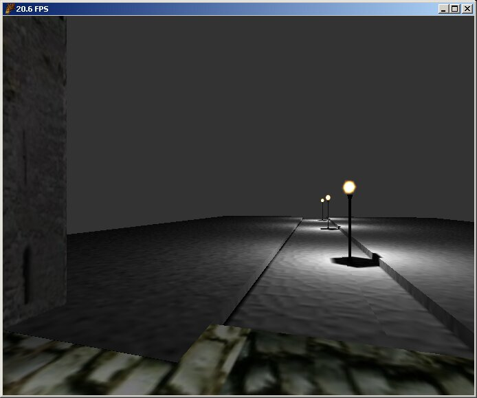

# OpenBSP
[OpenBSP](https://github.com/osman-turan/OpenBSP-Legacy) is [id Software](https://www.idsoftware.com/)'s Quake [.MAP format](https://modwiki.xnet.fi/MAP_(file_format)) compiler with [BSP](https://en.wikipedia.org/wiki/Binary_space_partitioning) tree generation, polygon generation/optimization and bumpmapped [lightmapping](https://en.wikipedia.org/wiki/Lightmapping).



## Features
- Supports Classic Quake, Brush Primitives (Quake III and compatible game engines) and Doom 3 [.MAP formats](https://modwiki.xnet.fi/MAP_(file_format)).
- Custom simple [BSP](https://en.wikipedia.org/wiki/Binary_space_partitioning) format generation with ready to use [GLScene](http://www.glscene.org/) loader.
- Supports 3D Studio (3DS), Quake III (MD3) and Doom 3 (MD5) mesh files for embedding static meshes into maps.
- Basic supports for Quake III shaders (.shader) and Doom 3 materials (.mtr)
- Supports JPEG and TGA textures.
- Optimized [BSP](https://en.wikipedia.org/wiki/Binary_space_partitioning) tree and polygon generation. 
- Static bumpmapped [lightmapping](https://en.wikipedia.org/wiki/Lightmapping) with multi-threadeding.

## What is not?
- It is not a game engine or a rendering engine.
- It does not create [BSP](https://en.wikipedia.org/wiki/Binary_space_partitioning) formats compatible with other game engines.
- It does not use any [space partitioning](https://en.wikipedia.org/wiki/Space_partitioning) methods other than [BSP](https://en.wikipedia.org/wiki/Binary_space_partitioning).
- It does not support [global illumination](https://en.wikipedia.org/wiki/Global_illumination) for [lightmapping](https://en.wikipedia.org/wiki/Lightmapping).
- It does not support [PVS (Potentially Visible Set)](https://en.wikipedia.org/wiki/Potentially_visible_set) for visibility culling.

## Usage
For a quick start, you can use [Skinhat](http://www.skinhat.com/)'s [3D Development Pack](http://www.skinhat.com/3dpack) which is an installation package that combines [Lazarus](http://www.lazarus-ide.org/), [GLScene](http://www.glscene.org/), [Quark](http://quark.sourceforge.net/) and [OpenBSP](https://github.com/osman-turan/OpenBSP-Legacy) to make it easy to make a 3D game.

If you don't want to use [3D Development Pack](http://www.skinhat.com/3dpack), you need a [.MAP](https://modwiki.xnet.fi/MAP_(file_format)) editor like [GtkRadiant](http://icculus.org/gtkradiant/) or [Quark](http://quark.sourceforge.net/) to build your map files. After designing your map, export it as [.MAP format](https://modwiki.xnet.fi/MAP_(file_format)) and compile with [OpenBSP](https://github.com/osman-turan/OpenBSP-Legacy).

To compile [.MAP file](https://modwiki.xnet.fi/MAP_(file_format)) with [OpenBSP](https://github.com/osman-turan/OpenBSP-Legacy), run following command:

```
$ obspc <Game Path> <Map Filename> <Options>
```

### Available Options
| Options           | Description                                                       |
|-------------------|-------------------------------------------------------------------|
| `-nolightmaps`    | Disables lightmapping process (full bright)                       |
| `-disablemp`      | Disables multi-threaded processing                                |
| `-subsamples [x]` | Changes subsampling amount in lightmapping                        |
| `-noshadows`      | Disables shadow casting                                           |
| `-savelightmaps`  | Saves lightmaps to external bitmap files in output file directory |

### Example
```
$ obspc "C:\Game\Base" "C:\Game\Base\test.map" -subsamples 4 -savelightmaps
```

## Contributing
Although, further development is not planned with current Pascal codebase, a complete rewrite in modern C++ is planned in unforeseen future.

## Authors
- [Osman Turan](https://osmanturan.com/) - _All OpenBSP development_
- Eric Grange - _Recycling Memory Manager_
- Mike Lischke - _3D Studio (3DS) model loader_

## License
This project is licensed under the MIT License - see the [LICENSE](LICENSE) file for details.

## Acknowledgments
- [Skinhat](http://www.skinhat.com/) for his great support and [3D Development Pack](http://www.skinhat.com/3dpack).
- [GLScene](http://www.glscene.org/) community for supports and ideas.